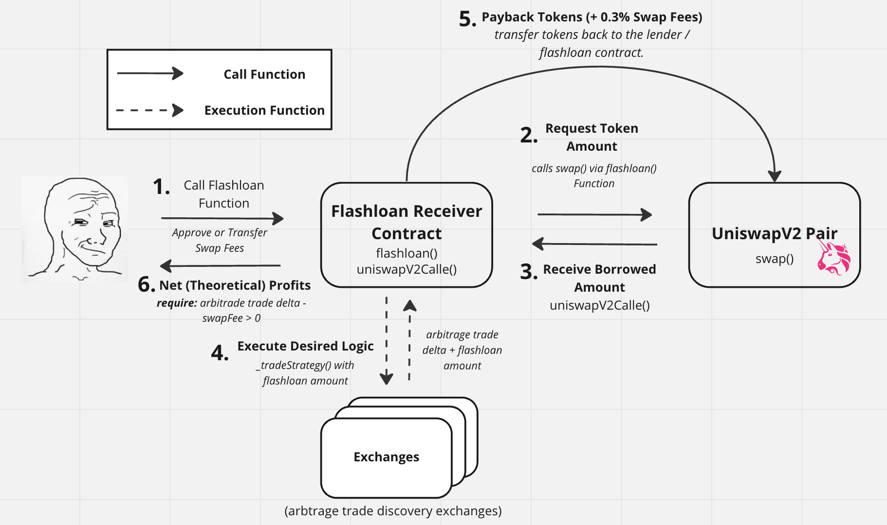

# Uniswap Foundry Scaffold

Experimental Scaffold to interact with UniswapV2 Protocol with Foundry tests.

Features Implemented:
- UniswapV2 
  - Flashloans - with arbitrage trade strategy scaffold
  - UniswapV2Router Helpers
  - ERC20 Permit Pool Interaction Flow (todo)
  - Multiple DEX Swaps
- UniswapV3 (Todo - Contributors Welcome) 
- ERC20 Permit (Todo)

[More Info on DeFi Flash Loans](https://smartbuilds.io/defi-flashloans-explained-uniswap-foundry/)

## Setup: Foundry Testing Environment

More on [Foundry Docs](https://book.getfoundry.sh/getting-started/installation)


```
forge install
forge test
```

## Forking Ethereum Mainnet

``` solidity
forge test --fork-url <your_rpc_url> -vvvv
forge test --fork-url <your_rpc_url> --fork-block-number
```
More Info to create an [RPC URL from Alchemy](https://www.alchemy.com/)


## Flashloans




```
forge test --match-test testFlashloanArbitrageTrade --fork-url <your_rpc_url> -vvvv
```

## UniswapV2Router Helpers

```
forge test --match-test testSwapEthForDAITokens --fork-url <your_rpc_url> -vvvv

forge test --match-test testSwapEthForAnyToken --fork-url <your_rpc_url> -vvvv

forge test --match-test testCannotSwapEthForInvalidTokenPair --fork-url <your_rpc_url> -vvvv

forge test --match-test testCanSwapEthForWETH --fork-url <your_rpc_url> -vvvv

forge test --match-test testCanSwapWETHForAnyToken --fork-url <your_rpc_url> -vvvv

forge test --match-test testCanSwapWETHForAnyTokenAnyPath --fork-url <your_rpc_url> -vvvv
```


## Acknowledgements

-   [Uniswap Labs](https://github.com/Uniswap)
-   [Foundry](https://github.com/gakonst/foundry)
-   [OpenZeppelin](https://github.com/OpenZeppelin/openzeppelin-contracts)
-   [Jeiwan UniSwapV2 Clone Walkthrough](https://github.com/Jeiwan/zuniswapv2)


## Disclaimer
These Smart Contracts are designed for Smart Contract Research Purposes. They have not been gas optimized. Do not use in production without a Security Audit.